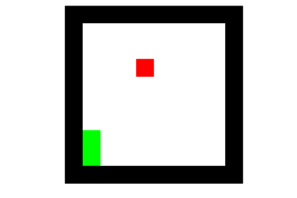
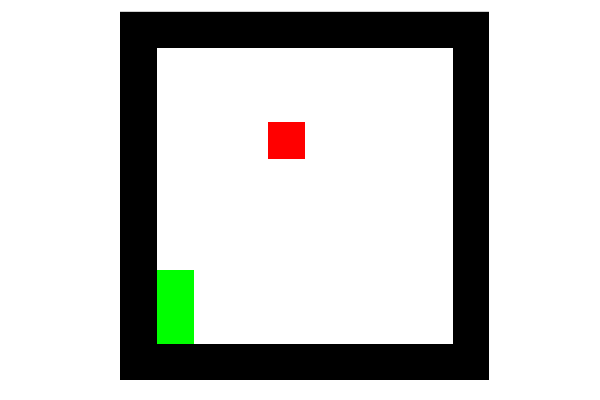
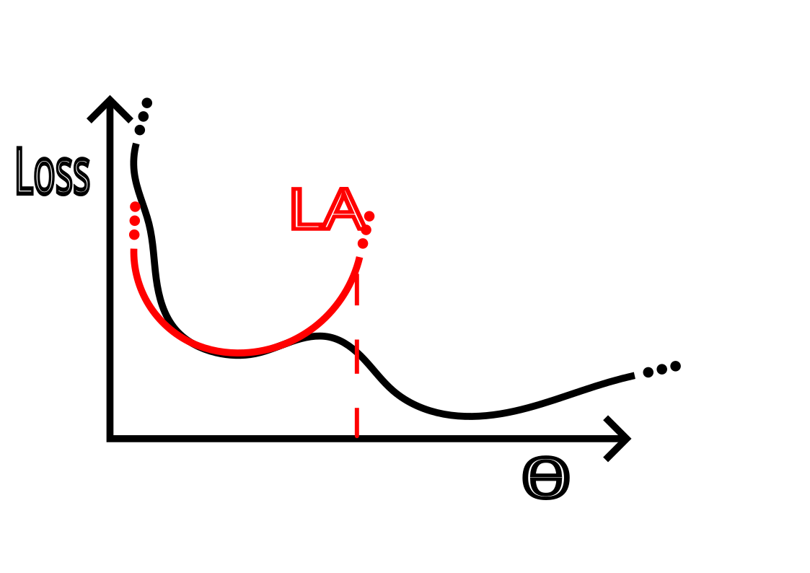
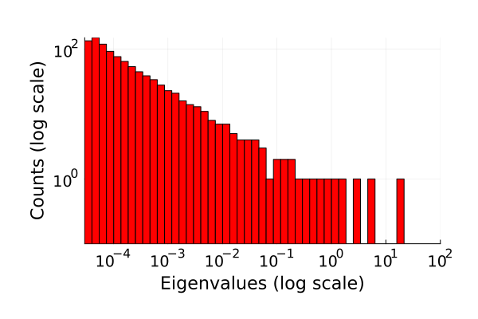
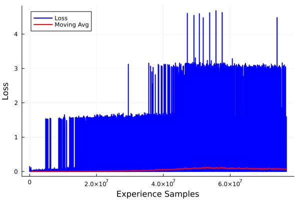
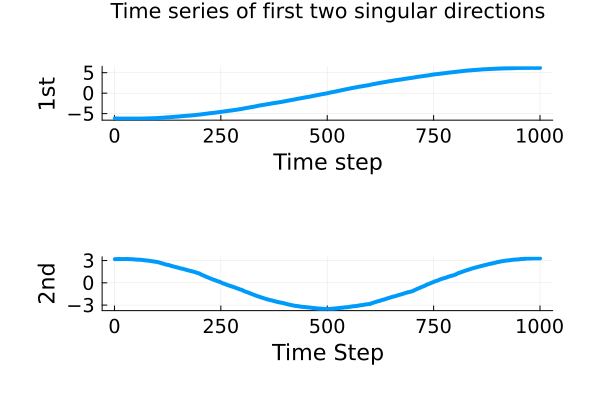

# Laplace-DQN-Snake-game
This repository contains my master's thesis project. It consists in two parts:
1. The application of the Deep-Q-learning (DQN) algorithm to the classic Snake game.
2. An attempt to extend the algorithm using the Laplace approximation, which will be explained in the next sections.
   
The snake is allowed to move inside a 2-dimensional playing field (game map) surrounded by walls. At each discrete interval (a time step), the snake must move forward, turn left, or turn right as the game requires that the snake cannot stop moving. 
The game will generate and place one piece of food on the game map whenever there is no food left. When the snake moves onto a piece of food, the food is eaten and the snake’s length grows by one.
The goal is to eat as many pieces of food as possible without ending the game by colliding the snake into itself or the walls.
The snake starts the game, as a single point, from the bottom left of the grid.

## Summary of the objective and the results
The project applies the Deep Q-Learning algorithm to the classic Snake Game and explores an alternative to the standard 
$\epsilon$-greedy exploration strategy. In particular, a sampling-based approach is tested, where the replay buffer is enriched with experience generated by models sampled from a Gaussian approximation of the loss function around a local minimum. However, this strategy did not lead to performance improvement.

## Structure of the repository
- `structs.jl` — definition of the mutable structs.
- `utils.jl` — methods for the environment and the DQN.
- `la_utils.jl` — methods for the Laplace extended algorithms.
- `imports.jl` — inclusion of the packages.
- `compute_D.jl` — computation of the D matrix.
- `plot_tra.jl` — script to plot the empirical spectral distribution of the low-rank correlation matrix and the projection of the $D$ matrix along the two main singular directions.
- `play_snake.jl` — GameZero snake game.
- `main.jl` — entry point for training the Snake agent.  
- `trainer_gifs/` — best games animations.
- `trainers/` — trainers saved as BSON. 
- `images/` — plots and figures.

## DQN
A vanilla DQN, with a single frame as state of the Q-nework leads to poor results (9 eaten apples). The following gif shows the best game after 100 000 mini-batches of training:

<em>
   Best game achieved with vanilla-DQN (score = 9).
</em>

## Improvements Applied to DQN for SnakeGame

1. **Two frames as input state**  
   Using two consecutive frames instead of one allows the Q-network to observe transitions, which helps learning motion dynamics.

2. **Reducing the number of actions per state**  
   The snake cannot move in the opposite direction to its current movement without losing.  
   Hence, we reduce the possible actions from 4 to 3 per state.

3. **Modified DQN Loss**  
   The standard DQN loss is:
   
   %3D\mathbb{E}_{(s,a,r,s^{\prime})\sim\mathrm{U}(D)}\left[\left(r%2B\gamma\operatorname*{max}_{a^{\prime}}Q(s^{\prime},a^{\prime};\theta_{i}^{-})-Q(s,a;\theta_{i})\right)^{2}\right]).
   
   However, the maximum over all actions can lead to overestimation of Q-values, which impairs performance.  
   By **excluding losing actions** from the maximum selection, we mitigate this effect.

After these improvements the snake reaches a score of 33. The best game played is the following:

<em>
Best game achieved after improvements (score = 33).
</em>

(See also this [DragonWarrior15](https://github.com/DragonWarrior15/snake-rl) from which I took inspiration).
The following table shows a list of the hyperparameters:

| Parameter | Value | Description |
|-----------|-------|-------------|
| Discount factor ($\gamma$) | 0.97 | Balances the importance of immediate versus future rewards. |
| Learning rate ($\eta$) | 0.0005 | Step size used by the optimizer (RMSProp). |
| Batch size | 64 | Number of experiences sampled from the buffer per training step. |
| Target update rate | 1000 | Frequency (in number of mini-batches) of synchronizing the target network with the Q-network. |
| Replay buffer capacity | 50,000 | Number of experiences stored in the buffer; training starts once the buffer is full. |
| Initial exploration rate ($\epsilon$) | 1.0 | Probability of choosing a random action at the beginning of training. |
| Final exploration rate | 0.05 | Minimum exploration rate during training. |
| Exploration decay rate | $1 \times 10^{-6}$ | Amount subtracted from $\epsilon$ after each mini-batch. |
| n\_batches | 1,200,000 | Total number of mini-batch updates performed. |
| Eating reward | 1.0 | Reward the agent gets for eating an apple. |
| Suicide penalty | -1.0 | Penalty the agent gets if it collides with a wall or itself. |
| Male di vivere | -0.01 | Penalty the agent receives for making a step without dying or eating an apple. |

A good metric to track the performance of the DQN is the average episode reward over a a window of episodes, as there is not a direct correspondence from the performance and the loss. This is the average episode reward over the last 5000 episodes:

## Laplace extended algorithm
The Laplace approximation locally approximates the loss function in the neural network weights space around a minimum fitting the best Gaussian.
Once the approximation is computed is possibile to sample models with probabilities given by the Gaussian; so, sampling models in the region next to the minimum have high probability, and more and more you move away from the minimum towards the tails of the distribution more the probabilty decreases. Applying such approximation to the loss landscape requires a pre-trained model, i.e. a model that has already reached a (global or local) minimum. 

There are several ways to build this approximation and the most of them boils down on how to compute the Hessian of the loss function with respect to the weights $\tfrac{\partial H_{ij}}{\partial \theta_i \theta_j}$. Indeed, directly computing it, is in my case infeasible because of the size of the Q-network.
My choice falls on a low rank approximation of the covarance matrix, which is the inverse of the Hessian for a Gaussian function.

The Laplace algorithm works following these steps:

1. **DQN Training**: train the Q-network using the DQN.
2. **Storing Q-network weights**: when the episode rewards plateuas start collecting the weights of the Q-network at every new mini-batch update.
3. **Computing Gaussian**: when the Q-network weights have been collected K times (which is the the size of the low-rank covariance) compute the covariance matrix approximation as a diagonal part + an off-diagonal part: $\Sigma = \tfrac{1}{2} \Sigma_\text{diag} \tfrac{1}{2} \Sigma_\text{off-diag}$. $\Sigma_\text{diag}$ is a diagonal matrix having the variances of the weights along the diagonal; $\Sigma_\text{off-diag} = \tfrac{1}{K - 1} D D^T$, where $D$ is a matrix having as columns the snapshots of the Q-network weights previously collected from which the average of them has been subtracted.
4. **Sampling new models**: Sampling models from the Gaussian distribution and use the ones with higher episode reward than the current Q-network to collect experience and add it to the buffer.
5. **Continue DQN**: go on with the DQN using the enriched buffer.

The idea behind it is that, ideally, after the DQN training is over, the Q-network has reached a local minimum and collecting experience of models sampled outside that minimum can perturb the Q-network out. Indeed, from the Gaussian approximation there is a not null probability to sample models outside that minimum as illustrated with the following figure:

  

The K parameter (dimensionality of the low-rank approximation), has been set studying the empirical spectral distribution (ESD) of a larger $\Gamma_\text{off-diag}$, obtained taking many snapshots of the Q-network weights. The histogram of the ESD is the following:

  

It scales like a power-law, therefore just taking K = 58, over 99 per cent of the variance of the bigger matrix is captured.

However, running the Laplace extended algorithm does not improve the average episode reward with respect to the standard DQN. 
One of the main reasons is, I believe, that the Q-network was actually not stuck in a minimum of the loss, but it was evolving between different models having the same performance. In fact, the loss never really reached a plateau and the $D$ matrix was changing along its first singular direction:

  
  

<em>
On the left, DQN Loss function: even if it is mostly flat and zero,  
the peaks show that RMSProp is still optimizing the model;  
On the right, Projection of D along its two first singular directions:  
while the second one seems to be periodic, the first one is not.
</em>

 Thus, there was not the sufficient condition to apply the Laplace Approximation to the Q-network. It remains to be explored if, after a longer DQN, in which the loss really flattens, this method can be effective to perturb the system out of the minimum. 
